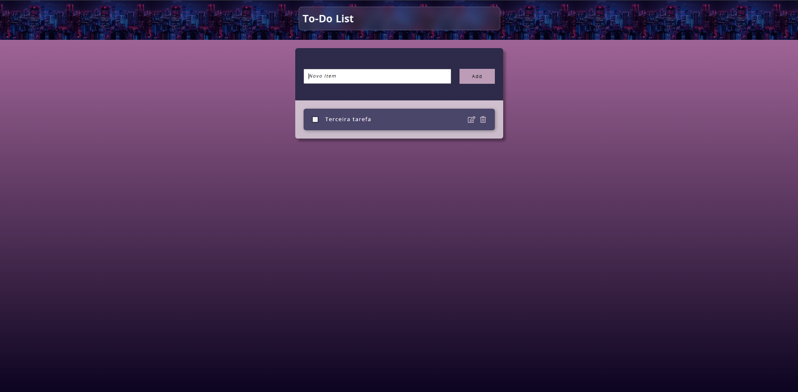
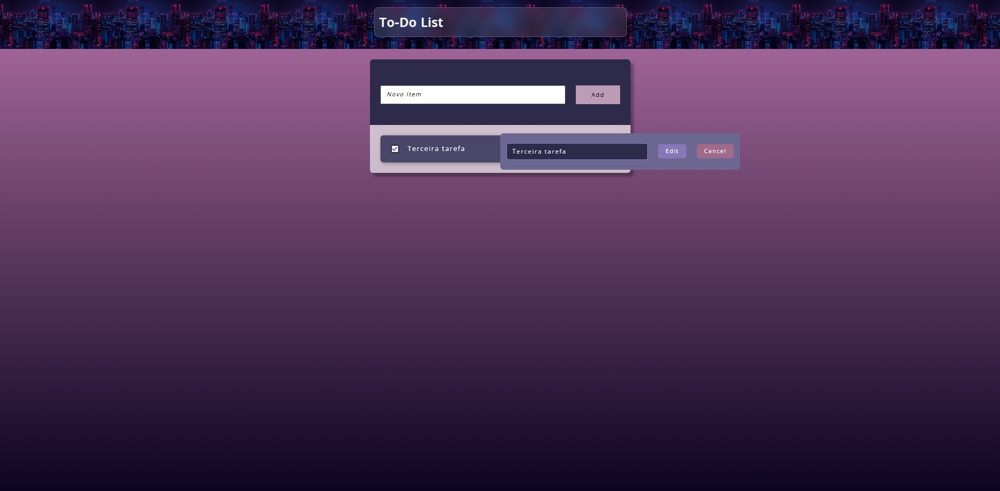

# 📋 To-Do List

Um aplicativo simples e intuitivo de lista de tarefas desenvolvido como projeto acadêmico para praticar conceitos fundamentais de desenvolvimento web.

---

## ✨ Descrição

O **To-Do List** é um aplicativo web que permite criar, visualizar, marcar como concluído e deletar tarefas. Com uma interface limpa e responsiva, o projeto demonstra boas práticas de organização de código utilizando o padrão **MVC** (Model-View-Controller).

### Funcionalidades principais:
- ✅ Adicionar novas tarefas
- ✓ Marcar tarefas como concluídas
- 🗑️ Deletar tarefas
- 💾 Persistência de dados com banco de dados local
- 📱 Design responsivo para diferentes tamanhos de tela

---

## 🛠️ Tecnologias Utilizadas

- **Frontend:**
  - HTML5
  - CSS3 (com design responsivo)
  - JavaScript ES6+ (módulos)
  - Bootstrap 5 (framework CSS)
  - Font Awesome (ícones)

- **Backend/Database:**
  - JSON Server (API REST local)
  - `db.json` (banco de dados JSON)

- **Ferramentas de Desenvolvimento:**
  - npm (gerenciador de pacotes)
  - concurrently (executar múltiplos scripts)
  - live-server (servidor com live reload)

---

## 📁 Estrutura de Pastas

```
todo-list-js/
│
├── todolist.html          # Página principal do aplicativo
├── package.json           # Configurações do projeto e dependências
├── db.json               # Banco de dados com as tarefas
├── docker-compose.yml    # Configuração para Docker
├── Dockerfile            # Imagem Docker do projeto
│
├── css/                  # Arquivos de estilo
│   ├── base.css          # Estilos base e gerais
│   ├── header.css        # Estilo do cabeçalho
│   ├── layout.css        # Layout geral da página
│   ├── responsive.css    # Media queries para responsividade
│   ├── todo_actions.css  # Estilos dos botões de ação
│   ├── todo_add.css      # Estilo do formulário de adicionar
│   └── todo_item.css     # Estilo dos itens da lista
│
├── js/                   # Arquivos JavaScript (Padrão MVC)
│   ├── config.js         # Configurações e constantes
│   ├── http.js           # Requisições HTTP
│   ├── todolist.js       # Arquivo principal (entry point)
│   │
│   ├── Model/
│   │   └── task_model.js # Modelo de dados da tarefa
│   │
│   ├── View/
│   │   └── tasks_view.js # Renderização das tarefas
│   │
│   ├── Controller/
│   │   └── tasks_controller.js  # Lógica de controle
│   │
│   └── Service/
│       └── tasks_service.js     # Serviço de tarefas (API)
│
└── image/                # Imagens e capturas de tela
    ├── capture1.png
    ├── capture2.png
    └── city.jpeg
```

---

## 🚀 Como Utilizar o Projeto

### Pré-requisitos

Certifique-se de ter instalado:
- **Node.js** (versão 14 ou superior)
- **npm** (gerenciador de pacotes do Node.js)

### Instalação

1. Clone o repositório ou faça download do projeto:
   ```bash
   git clone https://github.com/usuario/todo-list-js.git
   cd todo-list-js
   ```

2. Instale as dependências:
   ```bash
   npm install
   ```

### Executar o Projeto

#### Opção 1: Modo Desenvolvimento (com live reload)
Executa simultaneamente o JSON Server e um servidor web com recarregamento automático:
```bash
npm run dev
```

#### Opção 2: Apenas o Backend
Para executar apenas o JSON Server na porta 3000:
```bash
npm start
```

Após iniciar o servidor, acesse o aplicativo no seu navegador:
- **URL:** `http://localhost:8080` (modo dev)
- **URL:** `http://localhost:3000` (apenas backend)

### Como Usar

1. **Adicionar uma tarefa:**
   - Digite o texto da tarefa no campo "Novo Item"
   - Clique em "Add" ou pressione Enter

2. **Marcar como concluída:**
   - Clique no checkbox ao lado da tarefa

3. **Deletar uma tarefa:**
   - Clique no ícone de lixeira da tarefa desejada

---

## 📸 Exemplos de Uso

### Captura 1
Interface da aplicação com a lista de tarefas:



### Captura 2
Demonstração de interações e funcionalidades:



---

## 📚 Estrutura do Padrão MVC

O projeto segue a arquitetura **MVC** para organizar o código de forma limpa e manutenível:

- **Model** (`task_model.js`): Define a estrutura de dados de uma tarefa
- **View** (`tasks_view.js`): Responsável por renderizar as tarefas no DOM
- **Controller** (`tasks_controller.js`): Gerencia a lógica de interação entre o usuário e os dados
- **Service** (`tasks_service.js`): Comunica com a API (JSON Server)

---

## 📖 Notas Importantes

- O banco de dados é armazenado localmente em `db.json`
- Cada tarefa possui um ID único, título, status de conclusão e timestamps
- O projeto utiliza **Fetch API** para comunicação com o servidor
- O código está organizado em **módulos ES6** para melhor manutenibilidade

---

## 🐳 Usando Docker

Para executar o projeto em um container Docker:

```bash
docker-compose up
```

---

## 💡 Melhorias Futuras

- Adicionar autenticação de usuários
- Implementar diferentes categorias de tarefas
- Adicionar funcionalidade de editar tarefas
- Integrar com um banco de dados real (MongoDB, PostgreSQL, etc.)
- Adicionar testes automatizados

---

## 📄 Licença

ISC

---

**Desenvolvido como projeto acadêmico** 🎓

